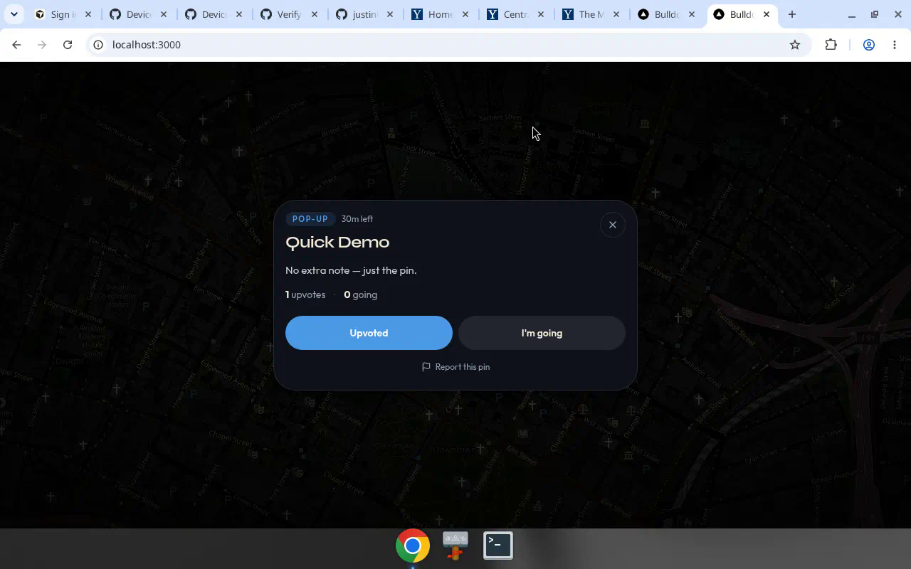

# Web

Live campus hotspot map for Yale. Students see where something is happening *right now*, drop a pin, and watch it fade when the night moves on.

**Tagline:** What's popping on campus right now.

Built for Rapid-fire Cursor (Yale student hackathon). Inspired by a live tracker vibe — no Marvel IP, no person tracking. Events and places only.

## Open this repo

**In Cursor Origin (browser):**  
[https://cursor.com/codebase/justin-kang/Bulldog-Tracker](https://cursor.com/codebase/justin-kang/Bulldog-Tracker)  
Private — change visibility on that page if you want.

That page is the repo, not the running app. To see the map, clone and run it locally (below). There is no separate public website unless you deploy one.

**On your machine:**

```bash
# Install the Origin CLI
curl -fsSL https://downloads.cursor.com/origin/install.sh | sh

# Sign in (also sets up git credentials)
origin auth login

# Clone the repository
origin repo clone justin-kang/Bulldog-Tracker
cd Bulldog-Tracker
```

If `origin` is not found after install:

```bash
echo 'export PATH="$HOME/.local/bin:$PATH"' >> ~/.zshrc
source ~/.zshrc
```

Origin CLI docs: [https://cursor.com/docs/origin/cli](https://cursor.com/docs/origin/cli)

Then start the app:

```bash
npm install
npm run build
npm start
```

Open [http://localhost:3000](http://localhost:3000). You should see a dark Yale map and five live pins.

Hard refresh (Ctrl/Cmd+Shift+R) if you still see “Locking onto campus…”.

## Features

- Dark cinematic map of Yale campus (New Haven) via Leaflet + OpenStreetMap / CARTO dark tiles (no API key)
- Active hotspot pins with heat (size, glow, opacity from votes, "I'm going", and recency)
- Drop a pin: tap the map or **Drop pin** → title, type, optional note, duration (30 / 60 / 90 / 120 min, default 60)
- Pin detail sheet: time left, upvote, I'm going, report
- Pins auto-expire when their duration is up
- Live-ish updates by polling every 4 seconds
- Anonymous device id in `localStorage` — no accounts
- Seeded demo pins at Cross Campus, Tsai CITY / Becton, Broadway, Pauli Murray / Science Hill, and Bass Library

## How to run (again)

Same commands as above. `npm start` listens on `0.0.0.0:3000` (override with `PORT`).

`npm run dev` is for local editing only and can fail to hydrate. For demos, always use `npm run build && npm start`.

## Usage

1. Pan around campus. Hotter pins glow larger.
2. Tap a pin (or a card in the dock) to upvote, mark **I'm going**, or report.
3. Tap empty map, or **Drop pin** + **Pin it here**, to create a hotspot.
4. When the timer hits zero, the pin disappears.

Reset demo data by deleting `data/pins.json` and refreshing. If every seed has expired, the server reseeds so a demo never opens on an empty map. Pins you drop still expire for real.

## Stack

- Next.js App Router, TypeScript, Tailwind CSS
- Leaflet + OpenStreetMap (CARTO dark basemap, no key)
- JSON file store via Route Handlers (`data/pins.json` locally, `/tmp` on Vercel)

## Vercel

This app is Vercel-ready (`npm run build` is a standard Next.js build). Persistence on serverless is best-effort: the store writes to `/tmp` and in-memory cache, so pins can reset between instances. For a durable deploy, swap the store for Postgres, SQLite on a persistent disk, or Vercel KV.

No environment variables are required.

## Demo captures



**Demo video:** add a 1–2 min walkthrough link (YouTube / Drive) in this README showing drop → upvote → expire, or place `docs/demo.mp4` here.

## Privacy

Web tracks *places and events*, not people. The only identifier is a random device id in the browser, used so you can't upvote the same pin twice in one browser.
